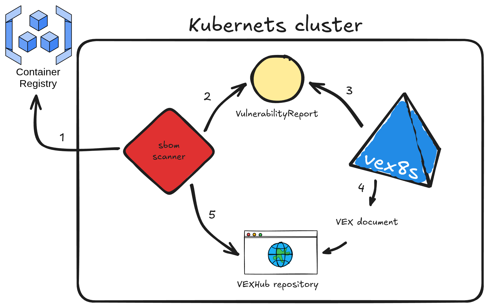

# vex8s-controller

## Description

`vex8s-controller` is an add-on for [SBOMscanner](github.com/alegrey91/sbomscanner) project. Its purpose is to automatically generate VEX documents based on the workloads running in a kubernetes cluster. It integrates directly with SBOMscanner by monitoring `VulnerabilityReports` created for container images and producing corresponding VEX documents that reflect each workload's `SecurityContext`.

Here's the workflow explained:

1. sbomscanner scans for images in registry
2. generates a VulnerabilityReport with the image CVEs
3. vex8s-controller triggers when a workload is scheduled on the cluster and generates a VEX document based on the workload SecurityContext configuration
4. the VEX document is provided by vex8s-controller using a VEX Hub repository
5. sbomscanner configure the VEXHub CRD to point to the internal vex8s-controller VEX Hub repository

## License

Copyright 2025.

Licensed under the Apache License, Version 2.0 (the "License");
you may not use this file except in compliance with the License.
You may obtain a copy of the License at

    http://www.apache.org/licenses/LICENSE-2.0

Unless required by applicable law or agreed to in writing, software
distributed under the License is distributed on an "AS IS" BASIS,
WITHOUT WARRANTIES OR CONDITIONS OF ANY KIND, either express or implied.
See the License for the specific language governing permissions and
limitations under the License.

